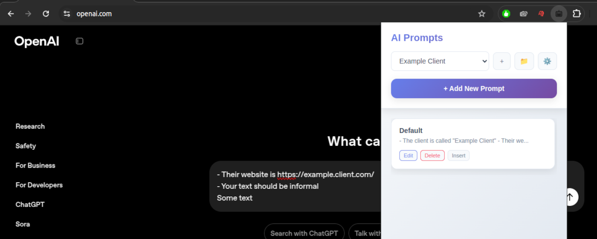

[](https://chromewebstore.google.com/detail/ai-prompts/cdkeckobdlbiicpdboijmbllkbkhggao)
[](https://chromewebstore.google.com/detail/ai-prompts/cdkeckobdlbiicpdboijmbllkbkhggao)

# AI Prompts - Browser Extension

A powerful Browser extension for organizing and quick-inserting prompts across AI chat platforms. Streamline your AI workflows with project-based prompt management and instant insertion.

## 🎯 Supported AI Platforms

- **OpenAI** - ChatGPT, OpenAI API playground
- **Anthropic** - Claude.ai, Console
- **Google** - Gemini
- **Microsoft** - Copilot
- **Perplexity** - Perplexity.ai
- **X/Grok** - X.com Grok chat

## 📸 In Action

<p align="center">
  
</p>

*The extension seamlessly integrates with AI platforms, providing a floating button for quick prompt access and a clean popup interface for prompt management.*

## 🚀 Key Features

### ✨ Smart Prompt Management
- **Project Organization** - Group prompts by projects for better organization
- **Quick Insertion** - One-click prompt insertion into AI chat interfaces
- **Floating Button** - Convenient AI magic button appears on supported sites
- **Context Menu** - Right-click to insert recent prompts

### 🔧 Professional Tools
- **CSV Import/Export** - Backup and share your prompt libraries
- **Cross-Device Sync** - Chrome storage sync keeps prompts available everywhere
- **Keyboard Shortcuts** - Fast access via hotkeys
- **Smart Detection** - Automatically detects input fields on AI platforms

## 🚀 Quick Start

### 1. Installation
1. Download the extension from Chrome Web Store *(coming soon)*
2. Or build from source (see Development section below)

### 2. Usage
1. **Visit any supported AI platform** (ChatGPT, Claude, etc.)
2. **Look for the ✨ floating button** near text input areas
3. **Click the button** to open the prompt selector
4. **Choose a project and prompt** to insert instantly
5. **Right-click** in text areas for quick access to recent prompts

### 3. Managing Prompts
1. **Click the extension icon** in Chrome toolbar
2. **Add new prompts** with title and content
3. **Organize by projects** for better workflow management
4. **Export/Import CSV** via Settings for backup and sharing

## 🛠️ Development

### Build from Source
```bash
# Clone and install dependencies
git clone https://github.com/flesler/ai-prompts
cd ai-prompts
npm install
# Run full test suite and build the extension
npm run prepack
```

### Load in Chrome
1. Open `chrome://extensions/`
2. Enable "Developer mode"
3. Click "Load unpacked"
4. Select the `dist/` folder

## 📁 Project Structure

```
src/
├── background.ts      # Service worker - context menus, shortcuts, messaging
├── content.ts         # Content script - floating button, input detection
├── popup.ts          # Main popup interface for prompt management
├── options.ts        # Settings page - notifications, import/export
├── domains.ts        # AI platform configurations and selectors
├── types.ts          # TypeScript interfaces and enums
├── utils.ts          # Shared utility functions
└── public/
    ├── manifest.json  # Browser extension manifest (v3)
    ├── popup.html     # Popup interface UI
    ├── options.html   # Settings page UI
    └── icons/         # Extension icons (16px, 48px, 128px)
```

## 🛠️ Available Scripts

| Command | Description |
|---------|-------------|
| `npm run build` | Build optimized extension for Chrome |
| `npm run prepack` | Run full test suite (lint + build) |
| `npm run lint:full` | TypeScript check + ESLint validation |
| `npm run lint:fix` | Auto-fix linting issues |
| `npm run dev` | Development build with watch mode |

## 🏗️ Technical Architecture

### Chrome Manifest V3
- **Service Worker** background script for lifecycle management
- **Content Scripts** injected into AI platform pages
- **Chrome Storage Sync** for cross-device prompt synchronization
- **Context Menus** for right-click prompt insertion
- **Keyboard Shortcuts** for quick access

### AI Platform Detection
- **Smart Selectors** - Detects input fields on each AI platform specifically
- **Fallback Support** - Generic detection for new or updated platforms
- **Real-time Updates** - Floating button follows input focus

### CSV Export Format
```csv
Project,Title,Content
"Work Project","Meeting Summary","Please summarize the key points..."
"Personal","Writing Helper","Help me improve this text..."
```

## ⚙️ Settings & Configuration

### Available Settings
- **Enable Notifications** - Browser notifications for extension actions
- **Enable Context Menu** - Right-click menu integration
- **Data Management** - CSV import/export functionality

### Keyboard Shortcuts
- `Ctrl+Shift+L` (Mac: `Cmd+Shift+L`) - Insert last used prompt

## 🔧 Development Features

### Modern TypeScript
- Strict type checking with `@types/chrome`
- ES2022+ features supported
- Modular architecture with clear separation of concerns

### Build System
- **tsup + esbuild** - Fast, modern bundling
- **Automatic minification** - Optimized production builds
- **Dynamic manifest generation** - Syncs version from package.json

### Code Quality
- **ESLint + TypeScript** - Comprehensive linting
- **DRY utilities** - Reusable helpers and patterns

## 📄 License

MIT License - Feel free to fork and modify for your own AI workflow needs!
